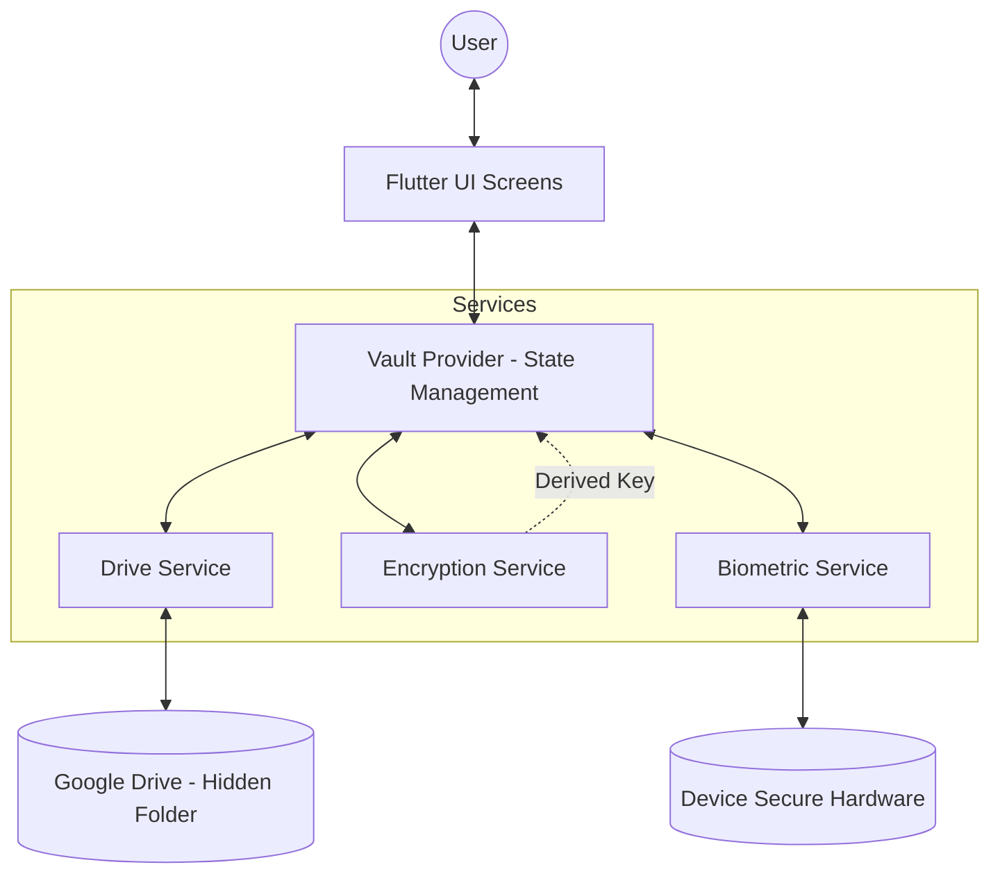
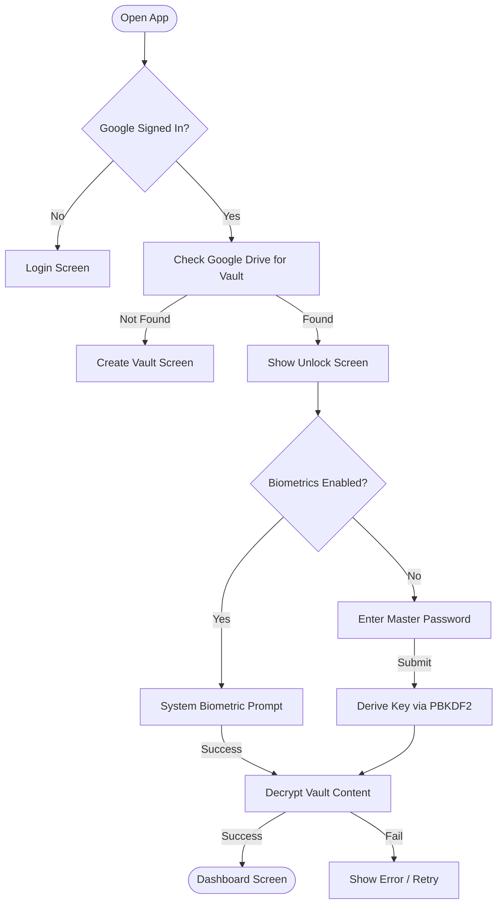
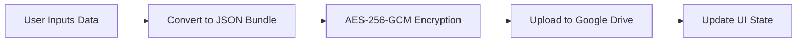

# Mero Vault: Technical Documentation & Architecture

## 1. Introduction
Mero Vault is a highly secure, zero-knowledge password management application built with Flutter. It leverages the user's personal Google Drive for cloud storage and utilizes industry-standard cryptographic algorithms to ensure that sensitive data is never stored in plain text or shared with any third-party servers.

---

## 2. Key Technologies
*   **Frontend Framework**: [Flutter](https://flutter.dev/) (Dart)
*   **Cloud Storage**: [Google Drive API](https://developers.google.com/drive) (Hidden `appDataFolder`)
*   **Authentication**: [Google Sign-In](https://pub.dev/packages/google_sign_in)
*   **Encryption (AES-256-GCM)**: Authenticated encryption ensuring both confidentiality and integrity.
*   **Key Derivation (PBKDF2)**: Hardens Master Passwords against brute-force attacks using 150,000 iterations.
*   **Biometrics**: [local_auth](https://pub.dev/packages/local_auth) for Fingerprint/FaceID integration.
*   **Secure Storage**: [Flutter Secure Storage](https://pub.dev/packages/flutter_secure_storage) (Encrypted SharedPreferences on Android).

---

## 3. Architecture Diagram



---

## 4. Operational Flowcharts

### A. Initialization & Unlock Flow
This flowchart describes what happens when the user opens the application.



### B. Data Persistence Flow (Saving an Entry)
This ensures that every "Save" action is immediately encrypted and synced to the cloud.



---

## 5. Security Deep-Dive

### Zero-Knowledge Architecture
*   **The Master Password**: Never leaves the device. It is only held in memory (RAM) while the app is active and discarded immediately when the app is closed or backgrounded.
*   **Encrypted Sync**: The file on Google Drive is a garbled "blob" of data. Even if Google’s servers were compromised, your passwords remain encrypted because the decryption key only exists in your mind (your Master Password).

### Cryptographic Stack
1.  **Salt**: A unique 16-byte random salt is generated for every vault to prevent "Rainbow Table" attacks.
2.  **PBKDF2**: We use 150,000 iterations of HMAC-SHA256 to derive the 256-bit AES key. This makes it computationally expensive for hackers to guess your password.
3.  **AES-GCM**: Unlike standard AES, GCM (Galois/Counter Mode) provides "Authenticated Encryption," which means if even one byte of the encrypted file is altered, the app will detect a "Tamper Error" and refuse to decrypt.

---

## 6. Project Structure

```text
lib/
├── features/        # UI Screens & Logic per Module
│   ├── auth/        # Login, Reset, Vault Creation
│   ├── home/        # Dashboard, Details, Add Entry
│   ├── splash/      # Loading, Initialization
│   └── navigation/  # Main Navigation Wrapper
├── models/          # Data Structures (VaultEntry, VaultField)
├── providers/       # Global State (VaultProvider)
├── services/        # Hardware & API logic (Drive, Crypto, Bio)
├── utils/           # Shared Tools (Transitions, Security Utils)
└── widgets/         # Reusable Custom Components (Toasts, AppBars)
```

---

## 7. Key Features Implemented
*   **Cloud Sync**: Automatic synchronization with Google Drive.
*   **Biometric Quick-Unlock**: Fast access using the device hardware security.
*   **Dynamic Custom Fields**: Users can add any number of fields (Username, PIN, URL, Note) to a single entry.
*   **In-Memory Session**: Automatic vault locking when the app is sent to the background.
*   **Sensitive Field Protection**: Individual fields can be marked as "Sensitive," requiring a second biometric check to be revealed.

---
**Documentation generated on 2025-12-25**
